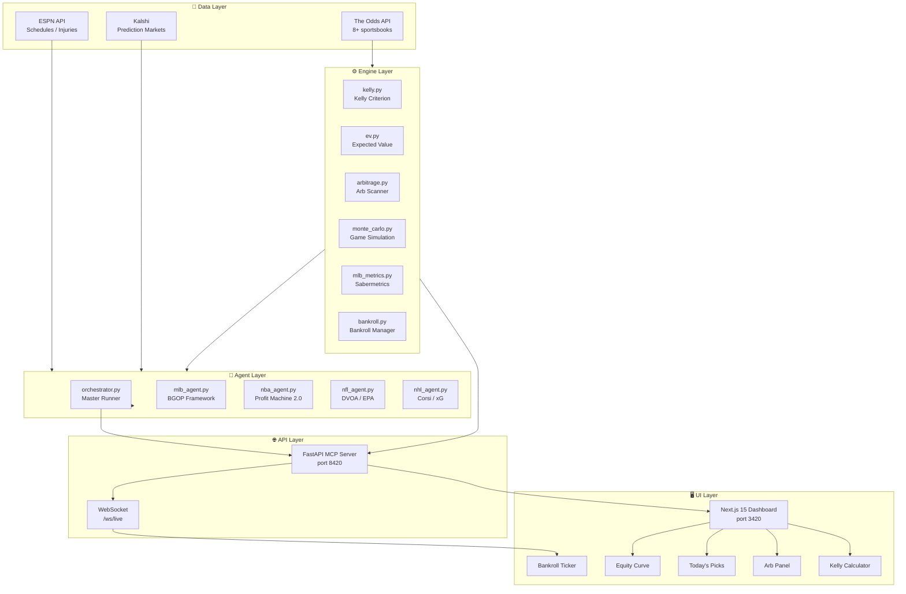
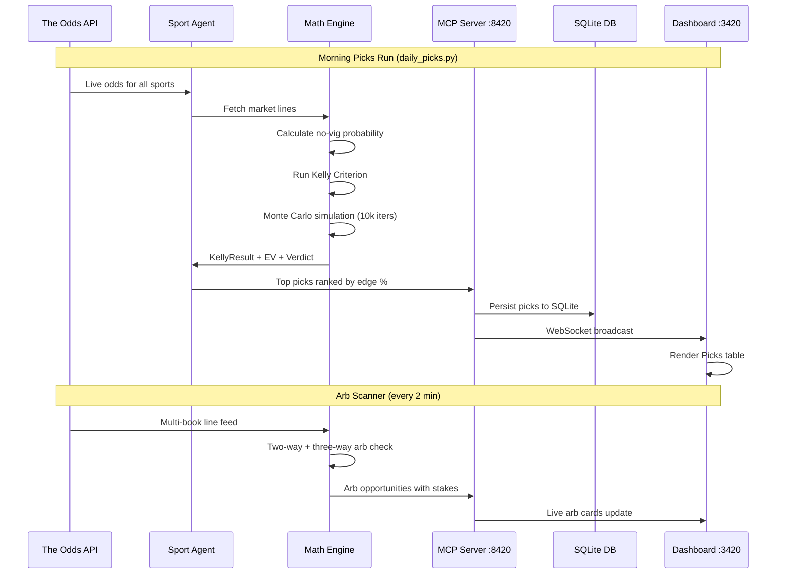
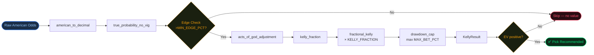
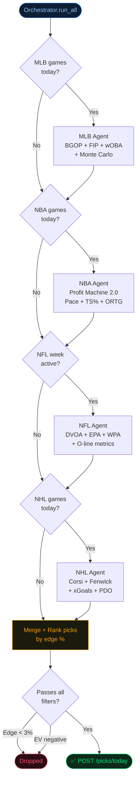
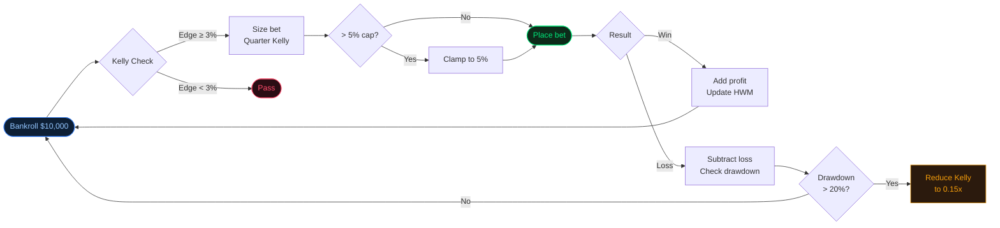

<div align="center">


[](https://python.org)
[](https://fastapi.tiangolo.com)
[](https://nextjs.org)
[](https://typescriptlang.org)
[](#)
[](#)

# KALISHI EDGE
### Personal AI Sports Betting Intelligence Platform

*Sovereign, private, zero-subscription. Your edge — calculated.*

</div>

---

## Table of Contents

| # | Section |
|---|---------|
| 1 | [Overview](#-overview) |
| 2 | [Feature Matrix](#-feature-matrix) |
| 3 | [System Architecture](#-system-architecture) |
| 4 | [Data Flow](#-data-flow) |
| 5 | [Betting Engine Pipeline](#-betting-engine-pipeline) |
| 6 | [Agent Decision Tree](#-agent-decision-tree) |
| 7 | [Quick Start](#-quick-start) |
| 8 | [API Reference](#-api-reference) |
| 9 | [Dashboard](#-dashboard) |
| 10 | [Configuration](#-configuration) |
| 11 | [Workflows](#-workflows) |
| 12 | [Engine Modules](#-engine-modules) |
| 13 | [Sports Coverage](#-sports-coverage) |
| 14 | [Bankroll Management](#-bankroll-management) |
| 15 | [Disclaimer](#-disclaimer) |

---

## 🎯 Overview

**Kalishi Edge** is a full-stack, AI-powered personal sports betting intelligence system. It combines:

- **Quantitative betting math** — Kelly Criterion, Expected Value, Arbitrage detection
- **Sport-specific sabermetrics** — FIP, wOBA, DVOA/EPA, Corsi/xG, Profit Machine Protocol 2.0
- **Monte Carlo simulation** — 10,000-iteration game sims per sport
- **Live odds ingestion** — 8+ sportsbooks via The Odds API
- **AI agent orchestration** — sport-specialized agents with a master orchestrator
- **Real-time dashboard** — Next.js 15 liquid-glass dark UI with live WebSocket updates

```
┌─────────────────────────────────────────────────────────────────┐
│   Live Odds (8+ books) → AI Agents → Kelly/EV Engine → Picks   │
│   ↓                                                             │
│   Next.js Dashboard (port 3420) ←── FastAPI MCP (port 8420)    │
└─────────────────────────────────────────────────────────────────┘
```

---

## 🔥 Feature Matrix

| Category | Feature | Status |
|----------|---------|--------|
| 📐 **Math Engine** | Full + Fractional Kelly Criterion | ✅ |
| 📐 **Math Engine** | Expected Value (EV) with no-vig probability | ✅ |
| 📐 **Math Engine** | Two-way & Three-way Arbitrage detection | ✅ |
| 📐 **Math Engine** | Monte Carlo game simulation (10k iters) | ✅ |
| ⚾ **MLB** | FIP / xFIP / wOBA / wRC+ / BABIP / ERA+ | ✅ |
| ⚾ **MLB** | BGOP Framework (Base God Offense Protocol) | ✅ |
| 🏀 **NBA** | Profit Machine Protocol 2.0 (pace, TS%, ORTG) | ✅ |
| 🏈 **NFL** | DVOA / EPA / WPA / CPOE analysis | ✅ |
| 🏒 **NHL** | Corsi / Fenwick / xGoals / PDO | ✅ |
| 📊 **Odds** | Live ingestion from 8+ sportsbooks | ✅ |
| 📊 **CLV** | Closing Line Value tracking | ✅ |
| 🎲 **Markets** | Kalshi prediction market integration | ✅ |
| 💰 **Bankroll** | Tracker + drawdown protection + HWM | ✅ |
| 🤖 **Agents** | 4 sport agents + master orchestrator | ✅ |
| 🖥️ **Dashboard** | Next.js 15 + Tailwind + Recharts charts | ✅ |
| 🔴 **Live** | WebSocket real-time dashboard updates | ✅ |
| ⚡ **API** | FastAPI MCP server (port 8420) | ✅ |

---

## 🏗 System Architecture



---

## 🔄 Data Flow



---

## ⚙️ Betting Engine Pipeline



---

## 🤖 Agent Decision Tree



---

## 🚀 Quick Start

**No API keys needed** — demo mode runs with a built-in Apr 6 2026 slate.

### One-click setup (Windows)

```powershell
git clone https://github.com/FTHTrading/Bet.git kalishi-edge
cd kalishi-edge
.\install.ps1
```

### Run picks immediately

```powershell
# View today's value picks + Kalshi dry-run (no real money)
python scripts\run_today.py

# Verify all connections and config
python scripts\test_connections.py

# Full daily workflow (picks, log, Kalshi dry-run)
python workflows\daily_picks.py

# Start API server + dashboard
.\start.ps1
```

> ✅ API → **http://localhost:8420/docs**  
> ✅ Dashboard → **http://localhost:3000**

### Add live data (optional)

```
# .env
ODDS_API_KEY=your_key      # https://the-odds-api.com  (free tier: 500 req/mo)
KALSHI_API_KEY=your_key    # https://kalshi.com/account/api  (requires account + fund)
```

To place **real** Kalshi orders once your key is added:

```powershell
python scripts\run_today.py --execute
```

### Manual setup (cross-platform)

```bash
pip install -r requirements.txt
python db/setup.py
cp .env.example .env   # or copy .env.example .env on Windows
python scripts/run_today.py
```

### One-command startup (PowerShell)

```powershell
.\start.ps1          # starts both API + dashboard
.\start.ps1 -ApiOnly
.\start.ps1 -DashOnly
```

---

## 📁 Project Structure

```
kalishi-edge/
│
├── 🔧 engine/                    Core betting math

---

## 📁 Project Structure

```
kalishi-edge/
│
├── 🔧 engine/                    Core betting math
│   ├── kelly.py                  Kelly Criterion, Profit Machine Protocol 2.0
│   ├── ev.py                     Expected Value, CLV, Acts of God adjustments
│   ├── arbitrage.py              2-way / 3-way cross-book arb detection
│   ├── monte_carlo.py            Game sims — MLB / NBA / NFL / NHL (10k iters)
│   ├── mlb_metrics.py            wOBA, FIP, xFIP, wRC+, BABIP, ERA+
│   └── bankroll.py               Bankroll tracker, bet lifecycle, HWM
│
├── 🤖 agents/                    Sport-specialized AI agents
│   ├── orchestrator.py           Master runner — calls all agents, merges picks
│   ├── mlb_agent.py              BGOP + sabermetrics + Monte Carlo
│   ├── nba_agent.py              Profit Machine Protocol 2.0 (pace, TS%, ORTG)
│   ├── nfl_agent.py              DVOA / EPA / WPA / weather / O-line
│   └── nhl_agent.py              Corsi / Fenwick / xGoals / PDO
│
├── 🌐 mcp/
│   └── server.py                 FastAPI MCP server  →  port 8420
│
├── 📡 data/feeds/
│   ├── odds_api.py               The Odds API — live odds, 8+ sportsbooks
│   ├── espn.py                   ESPN — schedules, injuries, news
│   └── kalshi.py                 Kalshi prediction market integration
│
├── ⚡ workflows/
│   ├── daily_picks.py            Morning run — full picks across all sports
│   ├── live_monitor.py           Real-time line movement watcher
│   └── arbitrage_scan.py         Continuous arb scanner (every 2 min)
│
├── 🖥️ dashboard/                Next.js 15 + Tailwind + Recharts
│   └── src/app/
│       ├── page.tsx              Main dashboard (glass UI, WebSocket)
│       ├── layout.tsx            Root layout
│       └── globals.css           Liquid-glass design system
│
├── 🗄️ db/
│   ├── setup.py                  Creates SQLite schema
│   └── logs/                     JSON pick/arb/movement logs
│
├── start.ps1                     PowerShell startup script
├── requirements.txt
├── .env.example
└── README.md
```

---

## 🌐 API Reference

> Base URL: `http://localhost:8420`

| Method | Endpoint | Description | Color |
|--------|----------|-------------|-------|
| `GET` | `/health` | Server health check | 🟢 |
| `GET` | `/picks/today` | Top picks ranked by edge % | 🟢 |
| `POST` | `/kelly` | Kelly stake calculator | 🔵 |
| `POST` | `/ev` | Expected value calculator | 🔵 |
| `POST` | `/arbitrage` | Two-way / three-way arb finder | 🟡 |
| `GET` | `/no-vig` | True no-vig probabilities | 🔵 |
| `POST` | `/profit-machine` | Profit Machine Protocol 2.0 allocation | 🟣 |
| `POST` | `/acts-of-god` | Weather / injury / travel adjustments | 🟡 |
| `POST` | `/simulate/mlb` | MLB Monte Carlo game simulation | ⚾ |
| `POST` | `/simulate/nba` | NBA Monte Carlo game simulation | 🏀 |
| `POST` | `/simulate/nfl` | NFL Monte Carlo game simulation | 🏈 |
| `POST` | `/simulate/nhl` | NHL Monte Carlo game simulation | 🏒 |
| `GET` | `/bankroll` | Current bankroll state + metrics | 💰 |
| `GET` | `/bankroll/history` | P&L history for equity curve | 📈 |
| `GET` | `/bets` | Bet log (recent 20, filterable) | 📋 |
| `POST` | `/bets` | Record a new bet | 📝 |
| `WS` | `/ws/live` | WebSocket — live dashboard feed | 🔴 |

### Example: Kelly Calculator

```bash
curl -X POST http://localhost:8420/kelly \
  -H "Content-Type: application/json" \
  -d '{"our_prob": 0.58, "american_odds": -110, "bankroll": 10000}'
```

```json
{
  "fraction": 0.1018,
  "recommended_stake": 254.55,
  "edge_pct": 10.18,
  "ev_per_unit": 0.12,
  "verdict": "STRONG VALUE — bet 2.5% of bankroll"
}
```

---

## 🖥️ Dashboard

The dashboard runs at **http://localhost:3420** and features a **liquid-glass dark UI** built with Next.js 15, Tailwind CSS, and Recharts.

| Panel | Description |
|-------|-------------|
| **Bankroll Ticker** | Live bankroll, ROI, win rate, CLV avg, daily P&L |
| **Equity Curve** | Area chart of bankroll history |
| **Today's Picks** | Full AI pick table — edge%, EV%, Kelly stake, verdict |
| **Arbitrage Panel** | Live arb cards with guaranteed profit and leg stakes |
| **Kelly Calculator** | Interactive calculator — enter odds + probability |
| **Bet Log** | Full history with results, P&L, open bets |
| **Live Indicator** | WebSocket connection status (green = live) |

---

## ⚙️ Configuration

Copy `.env.example` → `.env` and set the values below.

| Variable | Default | Required | Description |
|----------|---------|----------|-------------|
| `ODDS_API_KEY` | — | **Yes** | The Odds API key — [get free key](https://the-odds-api.com) |
| `KALSHI_API_KEY` | — | No | Kalshi prediction markets API key |
| `KALSHI_API_SECRET` | — | No | Kalshi API secret |
| `OPENAI_API_KEY` | — | No | OpenAI key for AI analysis overlay |
| `BANKROLL_TOTAL` | `10000` | No | Starting / current bankroll in USD |
| `KELLY_FRACTION` | `0.25` | No | Kelly multiplier (0.25 = Quarter Kelly) |
| `MAX_BET_PCT` | `0.05` | No | Max 5% of bankroll per single bet |
| `MIN_EDGE_PCT` | `0.03` | No | Min 3% edge required to size a bet |
| `MCP_PORT` | `8420` | No | MCP API server port |
| `ARB_SCAN_INTERVAL_SEC` | `120` | No | Arb scanner loop interval |

---

## ⚡ Workflows

### Morning Picks (`daily_picks.py`)
Runs all four sport agents, collects picks, ranks by edge%, filters weak plays.
```bash
python workflows/daily_picks.py
```

### Arbitrage Scanner (`arbitrage_scan.py`)
Polls all books every 2 minutes for guaranteed-profit opportunities.
```bash
python workflows/arbitrage_scan.py
```

### Live Monitor (`live_monitor.py`)
Watches for sharp line movement — early signal that sharp money has hit.
```bash
python workflows/live_monitor.py
```

---

## 🔬 Engine Modules

### `engine/kelly.py` — Kelly Criterion
```
f* = (bp − q) / b
b = decimal_odds − 1    (profit per unit staked)
p = our probability of winning
q = 1 − p
```
- Full Kelly, Quarter Kelly (default), Half Kelly
- Drawdown protection cap at `MAX_BET_PCT`
- `profit_machine_split()` — stacks 50/20/20/10 across correlated bets

### `engine/ev.py` — Expected Value
```
EV = (p × win) − (q × loss)
```
- Vig removal via `true_probability_no_vig()`
- CLV (Closing Line Value) tracking per bet
- `acts_of_god_adjustment()` — weather, injury, travel, back-to-back penalties

### `engine/arbitrage.py` — Arbitrage Detection
```
Arb exists when: (1/odds_A) + (1/odds_B) < 1.0
Guaranteed profit % = 1 − [(1/odds_A) + (1/odds_B)]
```
- 2-way and 3-way arb detection
- Optimal stake calculator for each leg
- Multi-book scan across all markets

### `engine/monte_carlo.py` — Game Simulation
- 10,000 iterations per game
- Sport-specific outcome distributions
- Win probability, spread probability, totals probability
- Confidence intervals on all outputs

### `engine/mlb_metrics.py` — Sabermetrics
- **FIP**: Fielding Independent Pitching
- **wOBA**: Weighted On-Base Average
- **wRC+**: Weighted Runs Created Plus
- **BABIP**: Batting Average on Balls in Play
- **ERA+**: Park-adjusted ERA
- `analyze_mlb_matchup()` — full BGOP framework analysis

---

## 🏆 Sports Coverage

| Sport | Key Metrics | Model |
|-------|-------------|-------|
| ⚾ **MLB** | FIP, xFIP, wOBA, wRC+, BABIP, ERA+, WHIP | BGOP + Monte Carlo |
| 🏀 **NBA** | Pace, TS%, ORTG, DRTG, Net Rating, PIE | Profit Machine 2.0 |
| 🏈 **NFL** | DVOA, EPA, WPA, CPOE, O-line rank, weather | DVOA/EPA model |
| 🏒 **NHL** | Corsi%, Fenwick%, xG/60, PDO, SV% | Corsi/xG + Poisson |

---

## 💰 Bankroll Management



**Drawdown Protection:**
- High water mark (HWM) tracked continuously
- At 15% drawdown: Kelly fraction reduced to 0.15x
- At 20% drawdown: Kelly fraction reduced to 0.10x
- All bets hard-capped at `MAX_BET_PCT` of current bankroll

---

## 📜 Disclaimer

> **Personal use only.** This system is a personal analytical tool. Sports betting involves
> significant financial risk. Probabilistic models do not guarantee outcomes. Past edge
> does not guarantee future results. Always manage your bankroll responsibly and comply
> with all applicable laws in your jurisdiction.

---

<div align="center">

**Built by Kevan Burns / FTH Trading**

[](https://github.com/FTHTrading/Bet)

*Kalishi Edge — Your sovereign edge, calculated.*

</div>

